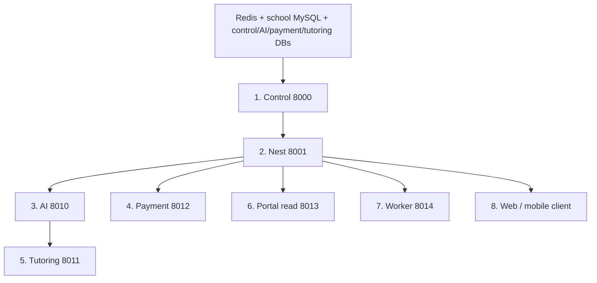

# Multi-Academy Performance Architecture

Permanent target: **control plane owns policy → Redis owns hot config → thin Edge API owns auth/routing → domain microservices own business logic → workers own slow work → client gets one bootstrap call.**

## Service map

| Service | Port | Role |
|---------|------|------|
| Control plane | 8000 | Policy, features, provider secrets |
| School Nest (full) | 8001 | Domain modules + internal routes |
| School Edge (thin) | 8001 / `EDGE_PORT` | Auth, bootstrap, proxies only |
| AI | 8010 | LLM / tutoring AI |
| Tutoring | 8011 | Marketplace |
| Payment | 8012 | Gateway orchestration |
| Portal read | 8013 | Cached portal dashboards |
| Worker | 8014 | Async notifications + report PDF |

## Local start order

Start **dependencies first**, then processes that call them. Nest can boot with empty `*_SERVICE_URL` (inline fallback). If those URLs are set, start the matching service before exercising that path.



| # | Process | Port | Wait for | Why |
|---|---------|------|----------|-----|
| 0 | Redis | 6379 | — | Nest runtime-config cache + portal-read cache |
| 0 | School MySQL / control DB | — | — | Nest tenant DBs + control (SQLite ok locally) |
| 0 | Neon / Postgres for Python services | — | — | AI, payment, tutoring (`DATABASE_URL`) |
| 1 | `control-system-server` | 8000 | Control DB | Flags, vault, payment/tutoring policy. Nest and payment/tutoring call it. |
| 2 | `web-server` (`npm run start:dev`) | 8001 | Redis, school DB, control | Only browser-facing school API. Portal-read and worker call `/internal/*` here. |
| 3 | `ai-service` | 8010 | AI DB + Pinecone/LLM keys | Nest AI routes + tutoring AI prep |
| 4 | `payment-service` | 8012 | Payment DB + control | Checkout/verify when `PAYMENT_SERVICE_URL` is set |
| 5 | `tutoring-service` | 8011 | Tutoring DB + control; AI if using prep | Marketplace. Start after AI for `/sessions/{id}/ai-prep`. |
| 6 | `portal-read-service` | 8013 | Redis + Nest | Fetches Nest `/internal/portal/*`. Do not start before Nest. |
| 7 | `worker-service` | 8014 | Nest | Fetches Nest `/internal/worker/*`. Do not start before Nest. |
| 8 | Web / mobile client | — | Nest | One `GET /config/bootstrap` on load |

**Do not start portal-read or worker before Nest** — they have no school data of their own.

**Thin edge** (`npm run start:edge:dev`) replaces the full Nest process on the same port. Use one or the other, not both.

Minimum useful stack: Redis → control (`8000`) → Nest (`8001`) → client. Add 8010–8014 only for the features you are testing.

## Phase A — hot path (implemented)

- **Redis runtime config** — `REDIS_URL` + `RUNTIME_CONFIG_REDIS_PREFIX`; webhook invalidation
- **JWT policy snapshot** — `config_version`, `tenant_status`, `features_digest` at login/refresh
- **Guard fast path** — feature + enforcement guards use `policySnapshotMatches()` on cache hit
- **Single bootstrap** — `GET /api/v1/config/bootstrap`
- **List cache** — users, academic lists, financial invoices/payments
- **Slim permissions guard** — skips tenant DB when route has no permission metadata
- **Tenant pool tuning** — `TENANT_DB_MAX_CACHED`, `TENANT_DB_EVICT_IDLE_MS`

## Phase B — read path + workers (implemented)

- **Portal read service** — Redis-cached aggregation; Nest delegates when `PORTAL_READ_SERVICE_URL` set
- **Internal portal routes** — `/api/v1/internal/portal/*` (service JWT, no circular delegation)
- **Worker service** — async notifications + PDF/DOCX report offload via `/internal/worker/*`

## Phase C — thin edge (implemented)

Run the edge entrypoint:

```bash
cd web-server
npm run start:edge:dev
```

Edge module imports: auth, bootstrap/config, users/me, payments/tutoring/AI clients, health.

## Phase D — scale + observability (implemented)

- **Slow request logging** — `SLOW_REQUEST_MS` (default 500); global interceptor
- **Shared Redis** — required for multi-replica Nest + portal-read cache
- **Regional colocation** — colocate app + Neon tenant DB in same region


## Realistic P95 targets

| Path | Target |
|------|--------|
| Bootstrap / config (cached) | 5–30 ms |
| Simple CRUD (1 indexed query) | 20–80 ms |
| Portal home (portal-read + Redis) | 30–100 ms |
| Payment verify / webhook | 200 ms–2 s |
| AI / bulk reports | seconds (async) |

## Nest env reference

```env
REDIS_URL=redis://localhost:6379
PORTAL_READ_SERVICE_URL=http://localhost:8013
WORKER_SERVICE_URL=http://localhost:8014
SERVICE_JWT_SECRET=change-me-in-production
INTERNAL_SERVICE_JWT_AUDIENCE=mas-school-internal
SLOW_REQUEST_MS=500
```

## Client

- One `GET /config/bootstrap` on app load (`useAppBootstrap`)
- Portal pages use React Query with 30s stale time
- Invalidate portal keys after pay/proof mutations


